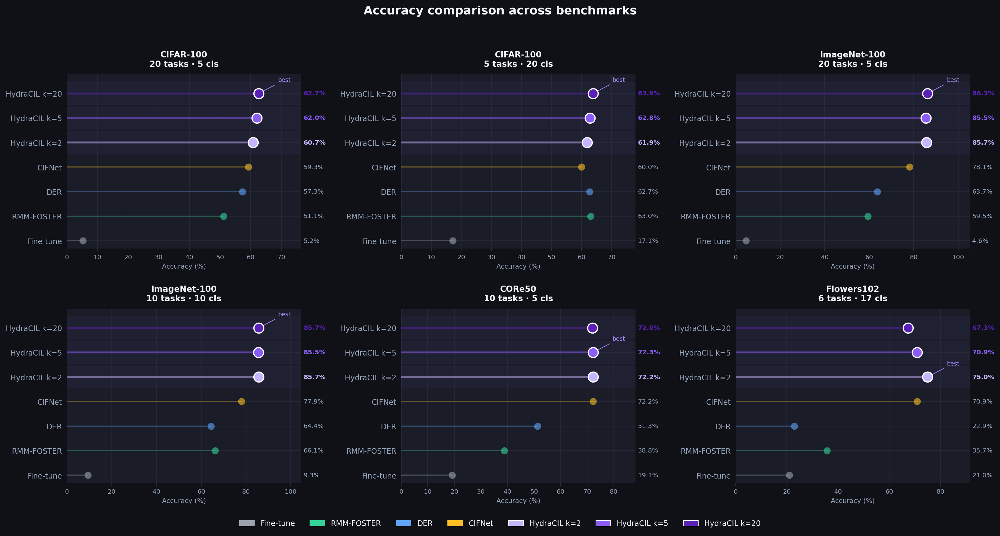
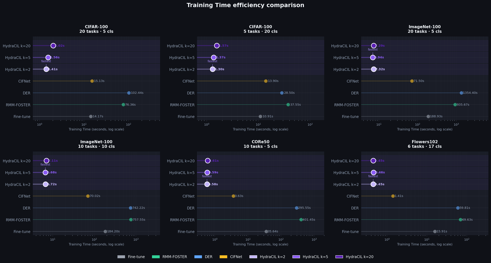

# HydraCIL: Decoupled Class-Incremental Learning through Prototype-Guided Multi-Head Classifiers
HydraCIL is a decoupled Class-Incremental Learning (CIL) framework designed for sustainable and resource-efficient continual learning. It targets scenarios where models must adapt sequentially to new classes under strict constraints on training time, memory, and energy consumption, such as edge devices and robotics systems.


> This work was published at the **International Joint Conference on Neural Networks (IJCNN 2026)**.

## 🔥 Highlights

- 🔁 **Task-incremental learning without backbone retraining**  
  Features are extracted once, avoiding repeated expensive training passes.

- 🧠 **Prototype-guided inference**  
  Class prototypes dynamically route samples to the task-specific head.

- ⚡ **Extreme training efficiency**  
  Up to **100×–600× faster training** compared to strong CIL baselines.

- 🌱 **Green AI approach**  
  Significantly reduces **energy consumption and CO₂ emissions**.

- 🧩 **Multi-head incremental learning**  
  Each task is handled by a lightweight, independent classifier head.

- 📉 **Scalable across tasks**  
  Maintains efficiency even as the number of tasks increases.

## Setup

1) Clone the repository
  ```bash
  git clone https://github.com/YOUR-REPO/HydraCIL.git
  cd HydraCIL
  ```
2) Install PyTorch
   
   This project requires PyTorch (with CUDA or CPU support).
   Example (CUDA 12.1):
   ```bash
   pip install torch torchvision torchaudio --index-url https://download.pytorch.org/whl/cu121
   ```
   Example (CPU):
   ```bash
   pip install torch torchvision torchaudio
   ```
3) Install project dependencies
    ```bash
    pip install -r requirements.txt
    ```
4) Download datasets and place them under the /data folder.
  Supported benchmarks:
    - CIFAR-100
    - ImageNet-100
    - CoRe50
    - Flowers102
## Run Experiments
  ```bash
  python main.py --config config.json
  ```

## Benchmark results




